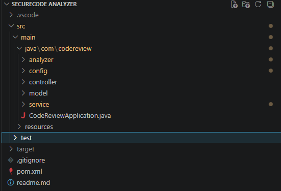
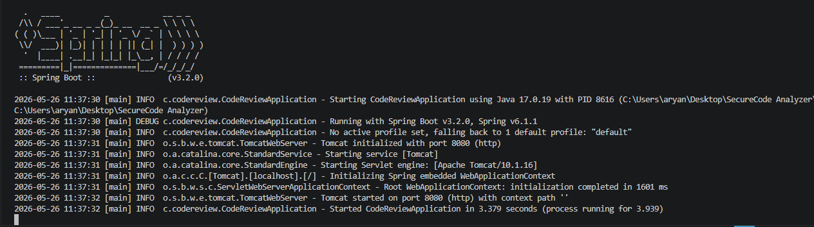
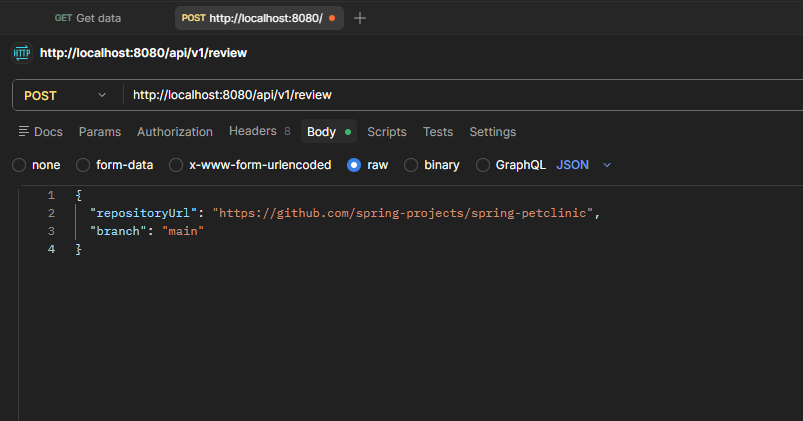
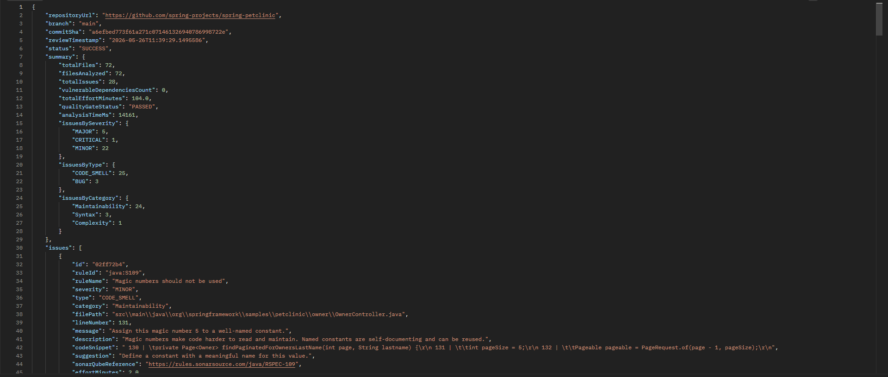

# SecureCode Analyzer

> A Java 17 Spring Boot backend application for static code analysis of GitHub repositories.

SecureCode Analyzer scans Java repositories, detects security vulnerabilities, bugs, and code smells, and generates structured JSON reports inspired by DevSecOps and SonarQube-style analysis workflows.

The project focuses heavily on backend engineering concepts such as:
- REST APIs
- Layered architecture
- Repository processing
- AST parsing
- Static analysis
- Exception handling
- JSON response generation

---

# Features

- Clone and analyze public GitHub repositories
- Parse Java source code using JavaParser
- Detect common vulnerabilities and coding issues
- Analyze Maven/Gradle dependencies
- Generate structured JSON reports
- REST API-based backend architecture
- Modular analyzer system for scalable rule additions

---

# Tech Stack

| Technology | Usage |
|---|---|
| Java 17 | Core backend development |
| Spring Boot 3 | REST API framework |
| Maven | Dependency management |
| JavaParser | AST parsing & static analysis |
| JGit | GitHub repository cloning |
| Lombok | Boilerplate reduction |
| Jackson | JSON serialization |
| JUnit | Testing |

---

# Project Architecture

```text
Client
   ↓
CodeReviewController
   ↓
CodeReviewService
   ↓
GitHubService
   ↓
Analyzers / VulnerabilityScanner
   ↓
CodeReviewResult JSON
```

---

# Project Structure

```text
src/main/java/com/codereview

controller/
  CodeReviewController
  GlobalExceptionHandler

service/
  CodeReviewService
  GitHubService
  VulnerabilityScanner

analyzer/
  AbstractJavaAnalyzer
  CodeAnalyzer

analyzer/sonar/
  SecurityAnalyzer
  BugAnalyzer
  CodeSmellAnalyzer

model/
  ReviewRequest
  CodeReviewResult
  CodeIssue
  VulnerableDependency

config/
  CodeReviewProperties
```

---

# Analyzer Modules

## Security Analyzer
Detects:
- SQL injection patterns
- Command injection risks
- Hardcoded credentials
- Weak cryptography usage
- Insecure random usage
- Path traversal vulnerabilities

---

## Bug Analyzer
Detects:
- Potential null dereference risks
- String comparison using `==`
- Return statements inside `finally`
- Infinite loops without exit conditions
- `hashCode()` / `equals()` mismatch

---

## Code Smell Analyzer
Detects:
- Long methods
- Magic numbers
- Empty catch blocks
- TODO/FIXME comments
- Excessive method parameters

---

# API Endpoints

## Check Service Status

```http
GET /api/v1/review/status
```

### Sample Response

```json
{
  "enabled": true,
  "message": "Code Review Service is enabled"
}
```

---

## Analyze Repository

```http
POST /api/v1/review
Content-Type: application/json
```

### Request Body

```json
{
  "repositoryUrl": "https://github.com/owner/repository",
  "branch": "main"
}
```

---

# Sample Analysis Response

```json
{
  "status": "SUCCESS",
  "summary": {
    "totalFiles": 72,
    "totalIssues": 28,
    "qualityGateStatus": "PASSED"
  }
}
```

---

# Screenshots

## Project Structure



---

## Spring Boot Application Running



---

## API Request Using Postman



---

## Static Analysis Response



---

# How It Works

```text
User sends GitHub repository URL
                ↓
Spring Boot API receives request
                ↓
Repository gets cloned using JGit
                ↓
Java files are parsed using JavaParser
                ↓
Analyzers scan source code
                ↓
Issues are categorized & aggregated
                ↓
Structured JSON report is generated
```

---

# Run Locally

## Start Application

```bash
mvn spring-boot:run
```

Application runs on:

```text
http://localhost:8080
```

---

# Run Tests

```bash
mvn test
```

---

# Current Status

- Backend APIs fully functional
- Repository scanning operational
- Java static analysis implemented
- JSON reporting implemented
- Tested using Postman
- Built and tested using Maven + Java 17

---

# Future Improvements

- Frontend dashboard
- Docker deployment
- CI/CD integration
- Multi-language support
- Authentication & authorization
- Cloud deployment support

---

# Learning Outcomes

This project helped in understanding:

- Spring Boot backend development
- REST API design
- Static code analysis concepts
- AST parsing using JavaParser
- Git repository processing
- Clean layered architecture
- Exception handling and validation
- Backend request lifecycle
- Modular analyzer design